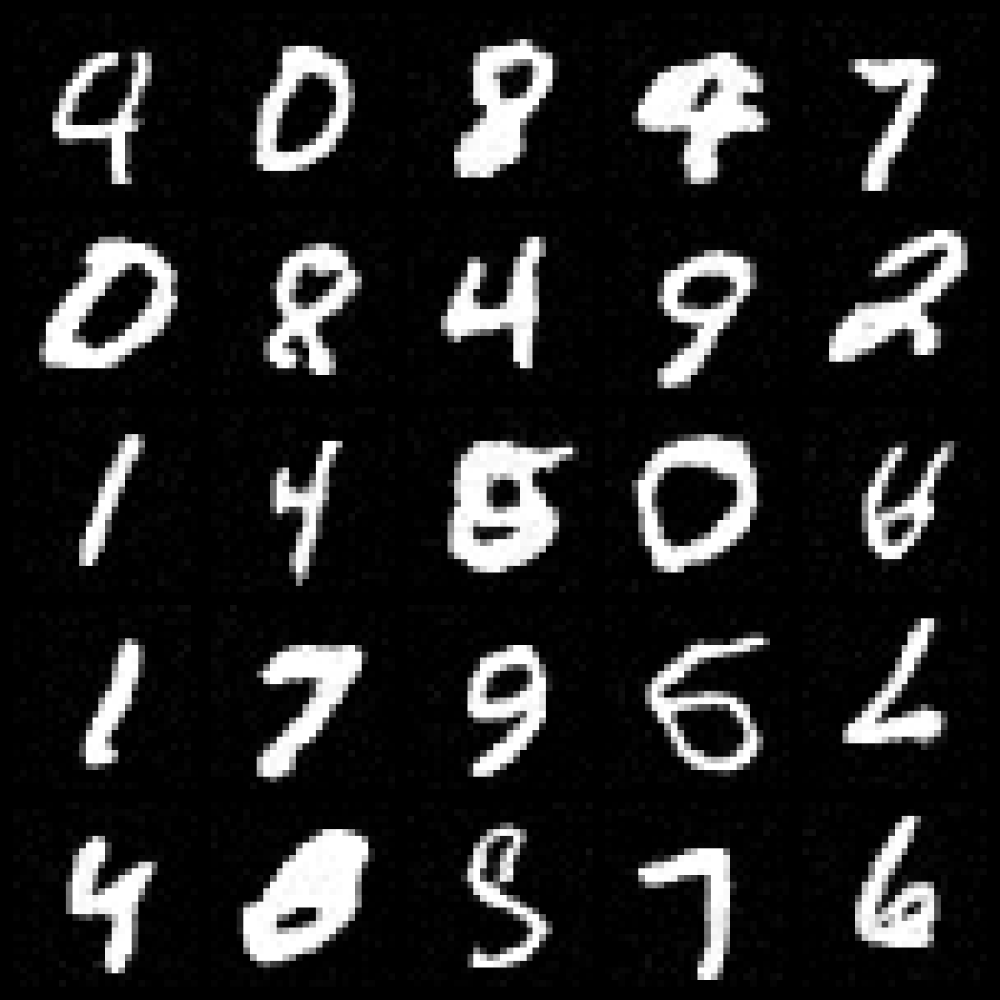

# Denoising Diffusion

This repo implements the Denoising Diffusion Probabilistic Model(DDPM) on the MNIST dataset. The repo just for me to better understand the DDPM so do not expect a high performance model and do not trust the results to much. For someone who wants to re-implementing the DDPM that is exactlly the same as the model proposed in [the paper](https://arxiv.org/abs/2006.11239), I would recommend to check out the code from [diffusers](https://github.com/huggingface/diffusers). In my repo, I only implement a vanilla Unet for modeling the $\theta_{t}$ without too much fascinating tricks. With such a simple model, I suppose the model can only deal with the images with low resolution such as MNIST. I recently try to add more features to the model to enhance the reperesentation power of the model e.g. using the PixcelCNN and the idea from Stable Diffusion. So, there are lots of uncompleted work in this repo. I will try to update the repo in the future.

## Quick Start 

Train
```bash
python train_ddpm.py --config configs/mnist_ddpm.yaml --task mnist
```

Inference
The anime gif and the image 
```bash
python sample.py
```


## Results
Images shown below is generated from a model which is trained on MNIST for 10K steps. Note that the result is not good enough. More iterations are needed to get a better result.

### Generated images



### Loss curve


## Reference

[1] [Denoising Diffusion Probabilistic Models](https://arxiv.org/abs/2006.11239)
